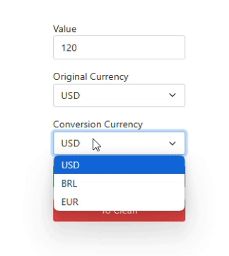

    

# Introduction

### The Local Currency Converter is a web project that allows the conversion of values ​​between different currencies without using external APIs. Using pure HTML, CSS and JavaScript, the system offers a simple and accessible solution where exchange rates are set manually in code. In this way, the project serves both as an introduction to web development and as a practical tool for conversion simulations without the need for connections to external services.

# Development

### To create the Local Currency Converter, we followed a modular approach, organizing the project structure and logic into easy-to-understand and maintain components. Here are the main steps for developing this project.

### This JavaScript code prevents a form with the ID "currencyForm" from being submitted and reloading the page. It uses "event.preventDefault()" to allow processing of data with JavaScript without refreshing the page.

### This JavaScript code takes the numerical value entered in the "amount" field and the origin and destination currencies from the "daMoeda" and "paraMoeda" fields. This data will be used for currency conversion.

### This JavaScript code takes the numerical value entered in the "amount" field and the origin and destination currencies from the "daMoeda" and "paraMoeda" fields. This data will be used for currency conversion.

### This code checks whether the source and destination currencies are the same. If they are, the value is not converted; otherwise, the value is multiplied by the exchange rate.

### This code is an essential tool for creating more interactive and dynamic web pages, allowing page content to update automatically based on data or calculations.

# Conclusions

# Used Tecnologies

## [W3schools](https://www.w3schools.com/)
## [GitHub](https://github.com/)
